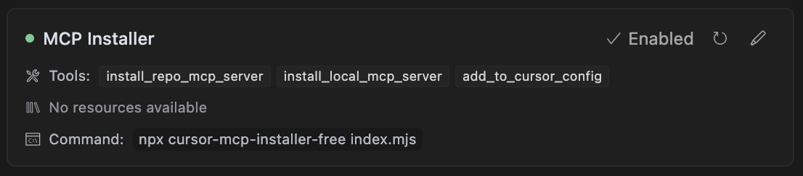

# Cursor MCP Installer

<div align="center">

<pre style="text-align: center;">
   ___         __  __    ___  __            ___   ___ 
  / __\/\ /\  /__\/ _\  /___\/__\  /\/\    / __\ / _ \
 / /  / / \ \/ \//\ \  //  // \// /    \  / /   / /_)/
/ /___\ \_/ / _  \_\ \/ \_// _  \/ /\/\ \/ /___/ ___/ 
\____/ \___/\/ \_/\__/\___/\/ \_/\/    \/\____/\/     
                                                      
  _____    __  __  _____  _      __    __    __  __   
  \_   \/\ \ \/ _\/__   \/_\    / /   / /   /__\/__\  
   / /\/  \/ /\ \   / /\//_\\  / /   / /   /_\ / \//  
/\/ /_/ /\  / _\ \ / / /  _  \/ /___/ /___//__/ _  \  
\____/\_\ \/  \__/ \/  \_/ \_/\____/\____/\__/\/ \_/  

+---------------------------------------------+
| 🚀 CURSOR MCP INSTALLER 🚀                 |
| ✨ Magically install MCP servers with ease ✨ |
+---------------------------------------------+
</pre>

  <p>A Model Context Protocol (MCP) server for installing and configuring other MCP servers within Cursor IDE.</p>
  
  [](https://opensource.org/licenses/MIT)
  [](https://www.npmjs.com/package/cursor-mcp-installer-free)
  [](https://github.com/anthropic-labs/model-context-protocol)
  [](https://cursor.sh)
  [](https://www.npmjs.com/package/cursor-mcp-installer-free)
  
  <a href="https://www.linkedin.com/in/digitalmarketingstrategyexpert/">
    
  </a>
</div>

> **📢 NOW AVAILABLE ON NPM!** Install with a simple `npm install -g cursor-mcp-installer-free` command or use directly with `npx cursor-mcp-installer-free` or `uvx cursor-mcp-installer-free`!

> **🔄 Latest Updates (v0.1.3):** Improved path handling for all MCP server installations, better OpenAPI schema detection, and more robust server discovery in local directories. Thanks to [@ItzAmirreza](https://github.com/ItzAmirreza) for submitting the initial installation path handling issue. See [CHANGELOG.md](CHANGELOG.md) for details.

## Quick Start Guide

### Step 1: Add to Cursor Configuration

Choose one of these methods to add the MCP Installer to your Cursor configuration:

#### Using npx (Easiest - No Installation Required)

Add this to your `~/.cursor/mcp.json` file (create it if it doesn't exist):

```json
{
  "mcpServers": {
    "MCP Installer": {
      "command": "npx",
      "type": "stdio",
      "args": [
        "cursor-mcp-installer-free@0.1.3",
        "index.mjs"
      ]
    }
  }
}
```

#### Using npm (Global Installation)

```bash
npm install -g cursor-mcp-installer-free@0.1.3
```

Then add to your `~/.cursor/mcp.json`:

```json
{
  "mcpServers": {
    "MCP Installer": {
      "command": "cursor-mcp-installer-free",
      "type": "stdio",
      "args": [
        "index.mjs"
      ]
    }
  }
}
```

### Step 2: Restart Cursor

Close and reopen Cursor to apply the configuration changes.

### Step 3: Use Claude to Install Servers

Ask Claude to install any MCP server for you:

```
Install the web search MCP server
```

or

```
Install the MCP server for OpenAPI schema exploration with my-schema.yaml
```

### Step 4: What You'll See When Installed

Once properly installed and Cursor is restarted, you'll see the MCP Installer available in the sidebar when using Claude:



The MCP Installer provides three main tools:
- `install_repo_mcp_server`: Install MCP servers from npm packages or repositories
- `install_local_mcp_server`: Install MCP servers from local directories
- `add_to_cursor_config`: Add custom MCP server configurations

## Features

- Install MCP servers from npm packages
- Install MCP servers from local directories
- Configure MCP servers for Cursor
- Add custom MCP server configurations

## Prerequisites

Before using this tool, you need to have installed:

- [Node.js](https://nodejs.org/) (for npm packages)
- [Cursor IDE](https://cursor.sh/)

## Installation

There are several ways to install and use the Cursor MCP Installer:

### 1. Using npm (Recommended)

```bash
npm install -g cursor-mcp-installer-free@0.1.3
```

After installation, add it to your Cursor MCP configuration file:

```json
{
  "mcpServers": {
    "MCP Installer": {
      "command": "cursor-mcp-installer-free",
      "type": "stdio",
      "args": [
        "index.mjs"
      ]
    }
  }
}
```

### 2. Using npx (No Installation Required)

You can use npx to run the package without installing it globally:

```json
{
  "mcpServers": {
    "MCP Installer": {
      "command": "npx",
      "type": "stdio",
      "args": [
        "cursor-mcp-installer-free@0.1.3",
        "index.mjs"
      ]
    }
  }
}
```

### 3. Direct from GitHub

Clone the repository and build it locally:

```bash
# Clone the repository
git clone https://github.com/matthewdcage/cursor-mcp-installer.git
cd cursor-mcp-installer

# Install dependencies and build
npm install
npm run build
```

Then configure Cursor to use your local installation:

```json
{
  "mcpServers": {
    "MCP Installer": {
      "command": "node",
      "type": "stdio",
      "args": [
        "/path/to/cursor-mcp-installer/lib/index.mjs"
      ]
    }
  }
}
```

Replace `/path/to/cursor-mcp-installer` with the actual path where you've cloned the repository.

### Where is the Cursor MCP Configuration File?

The Cursor MCP configuration file is located at:

- **macOS/Linux**: `~/.cursor/mcp.json`
- **Windows**: `%USERPROFILE%\.cursor\mcp.json`

If the file doesn't exist, you can create it with the content from any of the installation methods above.

## Path Handling Improvements in v0.1.3

Version 0.1.3 introduces significant improvements to path handling for MCP server installations:

### Enhanced Path Resolution
- Properly normalizes both relative and absolute paths
- Handles paths with spaces and special characters
- Ensures consistent path formatting across different operating systems

### Better Schema Detection
- Now scans all arguments for schema files, not just the first one
- Supports more schema file extensions (.yaml, .yml, .json, .openapi)
- Properly normalizes schema file paths before passing to servers

### Improved Server Discovery
- Added detection of common server entry points in local directories
- Enhanced support for Python-based MCP servers
- Better error reporting for path-related issues

These improvements make the MCP Installer more robust for all types of server installations, especially when dealing with custom file paths, OpenAPI schemas, and local directory installations.

## Usage

Once installed, you can use Claude or Cursor to interact with the MCP Installer. Here are some example prompts:

### Install an npm package as an MCP server

```
Install the MCP server named mcp-server-fetch
```

### Install with arguments

```
Install the @modelcontextprotocol/server-filesystem package as an MCP server. Use ['/home/user/documents'] for the arguments
```

### Install a local MCP server

```
Install the MCP server at /home/user/projects/my-mcp-server
```

### Install with environment variables

```